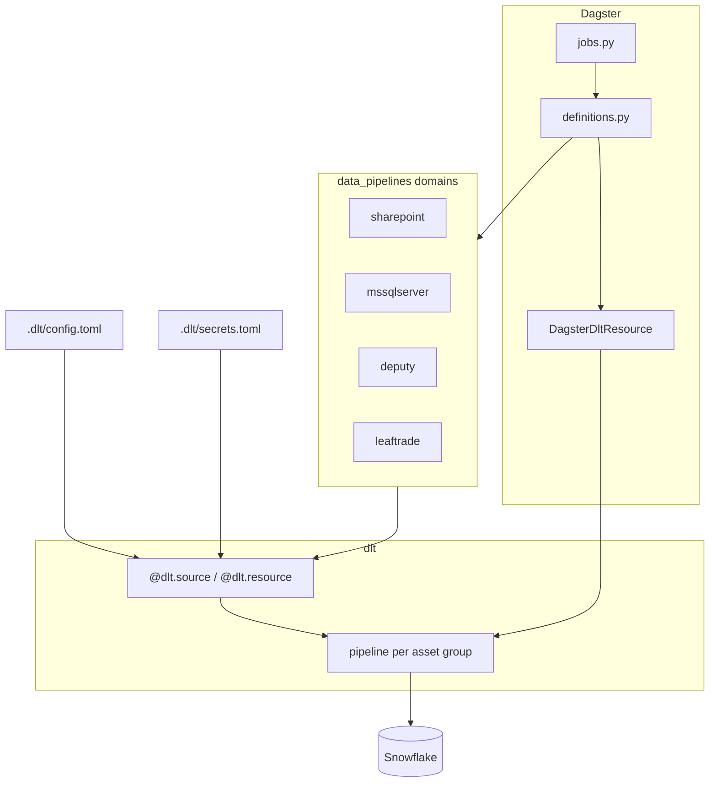

# Data pipelines (dlt + Dagster)

Domain-organized **dlt** ingestion pipelines orchestrated with **Dagster**, targeting Snowflake.

## Codebase architecture

### High-level flow



Each **domain** is a folder under [`data_pipelines/`](data_pipelines/) with `sources.py` (dlt sources/resources) and `assets.py` (one or more `@dlt_assets` multi-asset definitions). The root [`data_pipelines/definitions.py`](data_pipelines/definitions.py) registers every asset definition and exposes a single `dlt` resource to `dagster-dlt`. [`data_pipelines/jobs.py`](data_pipelines/jobs.py) defines `define_asset_job` entries scoped by **asset group** (`group_name` on each `@dlt_assets`).

### Domains

| Domain | Role | Primary config keys |
|--------|------|---------------------|
| [`sharepoint`](data_pipelines/sharepoint/) | Microsoft Graph (site/folder metadata, CSV downloads) | `[sources.sharepoint_graph]` |
| [`mssqlserver`](data_pipelines/mssqlserver/) | Azure SQL / SQL Server tables via `sql_database` (disabled — firewall) | `[sources.mssqlserver]` |
| [`deputy`](data_pipelines/deputy/) | Deputy REST `POST …/api/v1/resource/<Resource>/QUERY` (16 pipelines: 6 incremental + 10 dimension) | `[sources.deputy]` |
| [`leaftrade`](data_pipelines/leaftrade/) | LeafTrade REST GET API v3/v4 (12 pipelines: 7 full-load + 5 incremental) | `[sources.leaftrade]` |

Deputy uses one Snowflake **schema** (dlt `dataset_name`) for all its pipelines, default `DEPUTY` via `sources.deputy.snowflake_dataset_name`. Each pipeline writes a table named after its resource (for example `contact_incremental`, `company`).

LeafTrade uses one Snowflake **schema**, default `LEAFTRADE` via `sources.leaftrade.snowflake_dataset_name`. Full-load resources use `replace`; incremental resources use `merge` on `updated_at`.

### Repository layout (essentials)

| Path | Purpose |
|------|---------|
| [`data_pipelines/definitions.py`](data_pipelines/definitions.py) | `Definitions(assets=…, resources={"dlt": …}, jobs=ALL_JOBS)` |
| [`data_pipelines/jobs.py`](data_pipelines/jobs.py) | Jobs and optional schedules |
| [`data_pipelines/_template/`](data_pipelines/_template/) | Copy-paste scaffold for new domains ([`README`](data_pipelines/_template/README.md)) |
| [`.dlt/config.toml`](.dlt/config.toml) | Non-secret source and destination settings |
| [`.dlt/secrets.toml`](.dlt/secrets.toml) | Secrets (gitignored); see [`.dlt/secrets.toml.example`](.dlt/secrets.toml.example) |
| [`workspace.yaml`](workspace.yaml) | Dagster workspace → `data_pipelines.definitions` |
| [`.raw_json_config/`](.raw_json_config/) | Reference exports (e.g. Airbyte-style YAML/JSON); not read at runtime by pipelines |

### Adding a domain

Follow [`data_pipelines/_template/README.md`](data_pipelines/_template/README.md): copy the template, implement sources and assets, append assets in `definitions.py`, add jobs in `jobs.py`, and extend `[sources.<name>]` / secrets as needed.

## Setup

From this directory (project root — dlt uses **cwd** for `.dlt/`):

```bash
uv sync
```

Configure `.dlt/config.toml` and `.dlt/secrets.toml` as documented in the dlt workspace rules.

## Run Dagster locally

```bash
dagster dev -w workspace.yaml
```

Open the UI, then materialize assets or run jobs under **Jobs**.

SharePoint assets (from `dagster-dlt`): `dlt_sharepoint_graph_graph_site`, `dlt_sharepoint_graph_sharepoint_folder_children`, `dlt_sharepoint_csv_sweed_product_map`, `dlt_sharepoint_csv_rtl_product_mapping`, `dlt_sharepoint_csv_lt_product_mapping`.

Deputy jobs (one dlt pipeline each): `deputy_timesheet_incremental_job`, `deputy_roster_incremental_job`, `deputy_contact_incremental_job`, `deputy_timesheet_pay_return_incremental_job`, `deputy_employee_incremental_job`, `deputy_employee_history_incremental_job`, `deputy_company_job`, `deputy_operational_unit_job`, `deputy_pay_period_job`, `deputy_employee_job`, `deputy_employee_agreement_job`, `deputy_employment_contract_job`, `deputy_role_job`, `deputy_company_period_job`, `deputy_pay_rules_job`, `deputy_stress_profile_job`. Configure `sources.deputy.base_url` and `sources.deputy.api_token` (secrets) before running.

LeafTrade jobs: `leaftrade_dispensaries_job`, `leaftrade_accounts_job`, `leaftrade_strains_job`, `leaftrade_dispensary_classes_job`, `leaftrade_categories_job`, `leaftrade_stock_locations_job`, `leaftrade_vendor_users_new_job` (full-load), `leaftrade_products_job`, `leaftrade_batches_job`, `leaftrade_product_variants_job`, `leaftrade_stock_job`, `leaftrade_inventory_job` (incremental). Configure `sources.leaftrade.base_url` and `sources.leaftrade.api_key` (secrets) before running.

Validate definitions without starting the UI:

```bash
dagster definitions validate -w workspace.yaml
dagster asset list -m data_pipelines.definitions -a defs -d .
```

**Note:** In `data_pipelines/*/assets.py`, do not use `from __future__ import annotations` on files with `@dlt_assets` — Dagster needs real `AssetExecutionContext` annotations on the `context` parameter.

## Run SharePoint loads without Dagster (CLI)

```bash
uv run python rest_api_pipeline.py          # Graph folder listing
uv run python rest_api_pipeline.py csv      # CSV tables
```

## Add a new pipeline domain

Copy `data_pipelines/_template/` to `data_pipelines/<your_domain>/`, implement `sources.py` and `assets.py`, then wire assets and jobs in `data_pipelines/definitions.py` and `data_pipelines/jobs.py`. See `data_pipelines/_template/README.md`.

## GitHub and CI/CD

Treat **this folder** (`dlthub-projects/`) as the Git repository root when using the included workflows. If this project lives inside a monorepo, copy `.github/` into the real repo root and set `defaults.run.working-directory` in each workflow to this project path, or split this tree into its own repository.

### Workflows

| Workflow | Purpose |
|----------|---------|
| [`.github/workflows/ci.yml`](.github/workflows/ci.yml) | On push/PR to `main`/`master`: `uv sync`, Ruff, import `definitions`, `dagster definitions validate`. |
| [`.github/workflows/deploy-dagster-cloud.yml`](.github/workflows/deploy-dagster-cloud.yml) | Deploy the code location to [Dagster Cloud](https://docs.dagster.io/dagster-cloud) (Serverless-style build). **Skipped** until you configure secrets/variables (see below). |
| [`.github/workflows/docker-publish.yml`](.github/workflows/docker-publish.yml) | Build [`Dockerfile`](Dockerfile) and push to `ghcr.io/<owner>/<repo>/data-pipelines` on pushes to `main`/`master` and tags `v*`. |

### Dagster Cloud (optional)

1. Create a Dagster Cloud organization and deployment; connect GitHub per [Dagster docs](https://docs.dagster.io/dagster-cloud/getting-started).
2. In the GitHub repo: **Settings → Secrets and variables → Actions**
   - **Secret:** `DAGSTER_CLOUD_API_TOKEN` (from Dagster Cloud).
   - **Variable:** `DAGSTER_CLOUD_ORGANIZATION` (your org slug).
3. Adjust `deployment: prod` in `deploy-dagster-cloud.yml` if your deployment name differs.
4. [`dagster_cloud.yaml`](dagster_cloud.yaml) registers `data_pipelines` as the code location (`package_name: data_pipelines.definitions`).

Pipeline secrets (Snowflake, Graph, etc.) are **not** stored in the image or repo: configure them in Dagster Cloud environment variables or your agent runtime, using the same names dlt expects (e.g. `SOURCES__SHAREPOINT_GRAPH__CLIENT_SECRET`, `DESTINATION__SNOWFLAKE__CREDENTIALS__PASSWORD`). See [dlt secrets / env](https://dlthub.com/docs/general-usage/credentials/).

### Docker / GHCR

The image installs dependencies with `uv sync --no-dev --no-editable`. For reproducible builds, commit `uv.lock` and change the Dockerfile to use `uv sync --frozen --no-dev --no-editable`.

### Local checks (same as CI)

```bash
uv sync --group dev
uv run ruff check data_pipelines rest_api_pipeline.py
uv run ruff format --check data_pipelines rest_api_pipeline.py
uv run dagster definitions validate -w workspace.yaml
```
